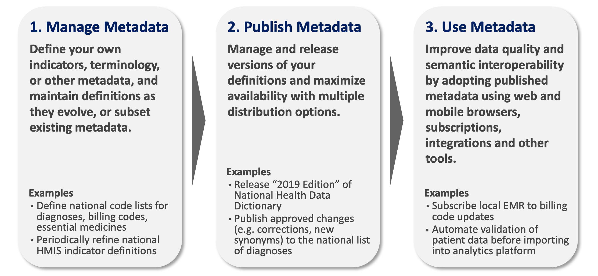

Welcome!
--------
**OCL Docs** is a community-maintained collection of documentation about our software and about our community. You can browse **OCL Docs** anonymously. Volunteers create documentation and maintain this site, and we invite you to help by improving content, filling gaps, and correcting errors. To contribute, request access to the `OpenConceptLab/ocl-docs<https://github.com/OpenConceptLab/ocl-docs>` repository on GitHub.

What is OCL?
------------
The Open Concept Lab (OCL) is an open-source terminology management system to help you collaboratively manage, publish and use your metadata in the cloud alongside the global community.

Here are the main use cases for adopting OCL:

OCL Overview
-------------

Learn more about OCL, its tools and its core features:

* **Overview of core OCL tools:** :doc:`OCL API Overview</oclapi/overview>` |  :doc:`OCL FHIR Overview</oclfhir/overview>` | :doc:`API Reference of OCL</oclapi/apireference/index>`
* **OCL roadmaps:** 
    * Current Roadmap:  `OCL Roadmap 2022 <https://openconceptlab.org/technical-roadmap/>`_
    * :doc:`Previous Roadmaps </roadmaps/2021/roadmap2>`
* **OCL releases:** :doc:`Release Notes </oclapi/releases>` 

Getting Started with OCL
-------------------------
Learn how to start contributing to OCL as a developer:

* **As a developer:** :doc:`Getting Started as a Developer</oclapi/developer/gettingstarted>` | :doc:`Developers Guide</oclapi/developer/developersguide>`

Advanced Features of OCL
--------------------------

Learn more about these integrations and how you can interact with OCL.

* **Retrieving Content from OCL's API** : Visit our `Swagger page <https://api.openconceptlab.org/swagger/>`_ for information about OCL's API endpoints and examples for retrieving terminology content  
* **Importing into OCL:** :doc:`Bulk Importing into OCL</oclapi/apireference/bulkimporting>` | :doc:`Importing CIEL into OCL </oclomrs/importingciel>`
* **Interface layer:** The interface layer is a set of API endpoints customized to support PEPFAR use cases through OpenHIM mediators. `Interface layer API Documentation <https://documenter.getpostman.com/view/10981858/TW77f3MH?version=latest>`_

OCL Releases
------------

OCL software releases are being published to `Dockerhub (tagged binaries) <https://hub.docker.com/u/openconceptlab>`_ and to `GitHub (tagged source code) <https://github.com/OpenConceptLab>`_. We follow `semantic release versioning <https://semver.org/>`_ i.e. the major.minor.maintenance-revision scheme e.g. 2.0.1-as435a47. Releases of oclapi2, oclweb2 and oclfhir are coordinated to maintain compatibility within the same minor version. We append a shortened Git SHA (8 characters) to each version so it is easier to track down specific commit used for that particular release. Release notes are available on GitHub for `oclapi2 <https://github.com/OpenConceptLab/oclapi2/releases>`_, `oclweb2 <https://github.com/OpenConceptLab/oclweb2/releases>`_ and `oclfhir <https://github.com/OpenConceptLab/oclfhir/releases>`_.

The user can check the version of software in the oclweb2 footer as well as in 'x-ocl-api-version' and 'x-ocl-fhir-version' response headers from API and FHIR REST services.

OCL Servers
------------

.. list-table::
   :widths: 50 50
   :header-rows: 1

   * - Environment
     - Servers
   * - Production
     - - `Community Website <https://openconceptlab.org/>`_
       - `Docs <https://docs.openconceptlab.org>`_
       - `API v2 <https://api.openconceptlab.org/>`_ 
       - `Web v2 <https://app.openconceptlab.org>`_ 
       - `FHIR <https://fhir.openconceptlab.org>`_
   * - Staging
       - `Web v2 <https://app.staging.openconceptlab.org>`_ 
     - - `API v2 <https://api.staging.openconceptlab.org/>`_ 
       - `FHIR <https://fhir.staging.openconceptlab.org>`_
   * - Demo
       - `Web v2 <https://app.demo.openconceptlab.org>`_ 
     - - `API v2 <https://api.demo.openconceptlab.org/>`_ 
       - `FHIR <https://fhir.demo.openconceptlab.org>`_
   * - QA
       - `Web v2 <https://app.qa.openconceptlab.org>`_ 
     - - `API v2 <https://api.qa.openconceptlab.org/>`_ 
       - `FHIR <https://fhir.qa.openconceptlab.org>`_

OCL Infrastructure
-------------------
OCL service is scalable, fault tolerant and highly-available.

OCL is running on AWS infrastructure. Our services are currently deployed in the us-east2 AWS region. All our services are replicated in two separate data centers within the region providing fast responses and high-availability. All our services are behind a load balancer, which constantly monitors and instantly redirects traffic if anything goes wrong. We can survive a failure of a service, a server instance or the whole data center without any downtime.

The entire content is being backed up every 24 hours.

We have rolling upgrades in place so most upgrades do not cause any downtime. We will let you know in advance, if a major upgrade is required, which may cause even small downtime.

The whole infrastructure is being managed via code with Terraform, which alows us to apply upgrades and track or revert changes if needed. We are also in position to restore the entire infrastructure from scratch in any other AWS region when the whole region goes down.

We scrupulously gather logs to troubleshoot any issues you report us.

.. toctree::
   :maxdepth: 4
   :hidden:
   :caption: OCL API
   
   oclapi/overview
   oclapi/apireference/index
   oclapi/developer/index
   oclapi/admin/index
   oclapi/releases
   oclapi/openmrsvalidationschema

.. toctree::
   :maxdepth: 2
   :hidden:
   :caption: OCL FHIR
   
   oclfhir/overview
   oclfhir/codesystem
   oclfhir/valueset
   oclfhir/conceptmap

.. toctree::
   :maxdepth: 2
   :hidden:
   :caption: OCL TermBrowser
   
   oclweb/configuringtermbrowser
   oclweb/FHIRconnectors
   
.. toctree::
   :maxdepth: 2
   :hidden:
   :caption: OpenMRS Dictionary Manager
   
   oclomrs/openmrstooclmapping
   oclomrs/importingciel

.. toctree::
   :maxdepth: 2
   :hidden:
   :caption: OCL Online

   oclonline/publicationplan

.. toctree::
   :maxdepth: 2
   :hidden:
   :caption: Other

   ocl/branding

.. toctree::
   :maxdepth: 2
   :hidden:
   :caption: Archived OCL Roadmaps

   roadmaps/2021/roadmap2
   roadmaps/2021/roadmap
   roadmaps/2020/roadmap
