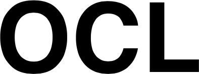
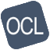

OCL Branding
============

Colors
-------

    - WHITE = '#FFF';
    - BLACK = '#0'; # secondary color
    - BLUE = 'rgb(51, 115, 170)'; # primary color, as well as concept/mapping color
    - GREEN = '#5cb85c'; # source/collection color
    - ORANGE = 'rgb(253, 164, 41)'; # user/org color
    - DARKGRAY = 'rgb(119, 119, 119)'; # tertiary
    - COLOR_ROW_SELECTED = 'rgba(119, 119, 119, 0.16)'; # row selection
    - RED = '#c33'; # retired color
    - ERROR_RED = '#f44336'; # error color
    - DIFF_BG_RED = '#ffeef0'; # comparison color
    - DIFF_HIGHLIGHT_RED = '#fdb8c0'; # comparison color
    - DIFF_BG_GREEN = '#e6ffed'; # comparison color
    - DIFF_HIGHLIGHT_GREEN = '#acf2bd'; # comparison color

Font
----

    - Font Family -- "Roboto", "Helvetica", "Arial", sans-serif
    - Font Weight -- 400;
    - Line-height: 1.43;
    - Letter-spacing: 0.01071em;

Design Guideline
-----------------

    `Material Design <https://material.io/design>`_

Icons
-----

    `Material Icons <https://fonts.google.com/icons?selected=Material+Icons>`_

Logos
------

|

|  

|

