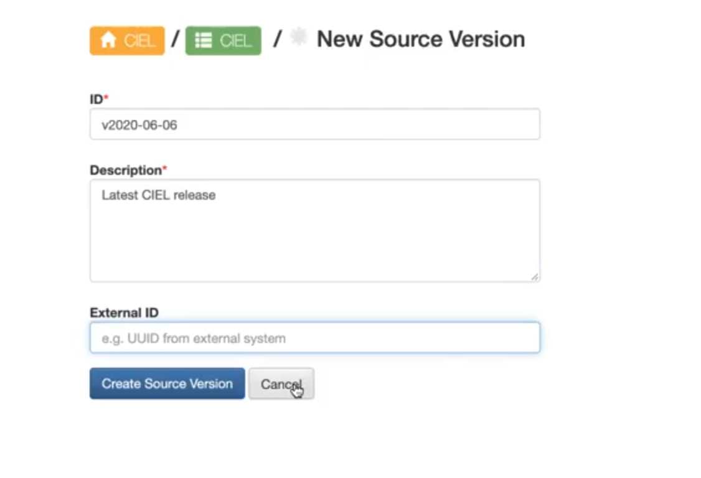
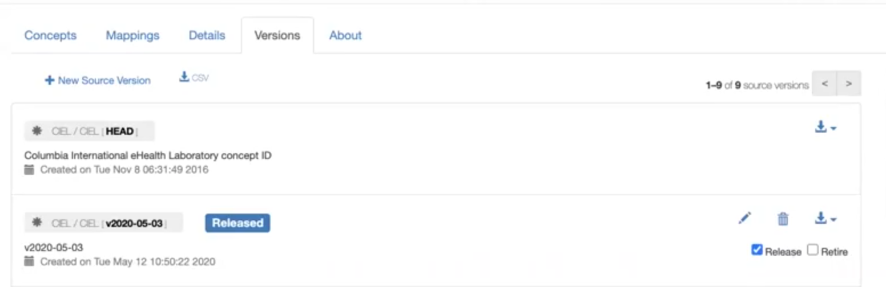

# Importing CIEL into OCL
Updated 2020-09-18

**Owner:** Burke

**Maintainer:** Maurya

## Near-term Objectives for CIEL import into OCL:
- Multiple people able to run the CIEL import process for staging and production and to update the database snapshot with a new CIEL release on qa and demo
- Achieve <72 hour turnaround time for importing a newly released CIEL dictionary
- Implement semi-automated (dockerized) process for preparing source CIEL dictionary for import that can be expanded in the future to run the import and source validation

## Note that the OCL for OpenMRS Squad has started to document processes as well:
- OCL for OpenMRS - Release details

## Questions:
- Where should this exist? Can we move this to a GitHub Readme - Google doc for now, Aug 19th, 2020 . Move this to 
- Should the intermediate processes be archived, saved or can be ignored? Should earlier ways be maintained as we are automating - No 
- How are/will sources be added into OCL? Basically Step C documentation
    - SQL to JSON conversion creates a json that is currently manually loaded using the bulk import
- Will the new concepts overwrite existing concepts and mappings? Or add to the existing ones? Or are we creating a version - Creates a new concepts for new concepts and update the earlier versions but we can bundle both of them
- What triggers the process after Andy has prepared a new CIEL release?
- Define turnaround time (eg <72 hours)
- Decision on how OCL announces availability of a new CIEL release

## Tickets to get from Current Process to Next Iteration:
- [Burke] Create docker container to automate CIEL import process: https://github.com/OpenConceptLab/ocl_issues/issues/266 
- [Rafal] Required update to OCL bulk import tool to handle larger import scripts: https://github.com/OpenConceptLab/ocl_issues/issues/210

## Next Steps:
- Maurya to follow up on the Ticket for Bulk import piece
- Maurya to update the Manual steps Rafal does

## Stages
### Current Process:
- [Andy] Manual preparation and export of CIEL concept dictionary by Andy Kanter from OpenMRS v1.6 to MySQL dumps in multiple OpenMRS versions posted to a Dropbox account managed by Andy.
- [Jon] Manual validation of CIEL map sources and adding missing organizations and sources into selected OCL environments.
- [Jon] Manual conversion of OpenMRS v1.11 concept dictionary retrieved from Dropbox to OCL-formatted JSON.
- [Rafal] Manually imported on selected OCL servers by an OCL system administrator with no automated validation checks.
- [Rafal] Database snapshots to automatically refresh QA and demo environments are manually updated when required.
### CIEL Import Milestone 1:
- [Andy] Manual preparation and export of CIEL concept dictionary by Andy Kanter from OpenMRS v1.6 to MySQL dumps in multiple OpenMRS versions posted to a Dropbox account managed by Andy.
- [tbd] Manual addition of missing organizations and sources into selected OCL environments.
- [Done - Burke] Dockerized validation and conversion of zipped CIEL MySql dump from OpenMRS v1.11 to OCL-formatted JSON if CIEL external map sources are all valid in the target OCL environment
- [tbd - In progress - Burke] Bulk import of updated CIEL dictionary on OCL staging and production that includes the JSON to generate a new source version as well
- [Rafal] Database snapshots to automatically refresh QA and demo environments are manually updated when required.
### CIEL Import Milestone 2?
- [tbd] Validate the OCL export of the newly imported CIEL dictionary against the original OCL-formatted JSON bulk import file generated directly from the MySQL concept dictionary.


## How to Import OpenMRS CIEL dictionary into OCL (Current Process)

1. Get the dictionary. MVP OpenMRS dictionary. This is currently in a dropbox managed by Andy Kanter as a Zip file of a mysql dump.
2. Currently setup to import 11.4 version of MVP OpenMRS dictionary
3. Steps and documentation for the steps available here OpenConceptLab/ocl_omrs: Importer for OpenMRS concept dictionary into OCL.
4. Version of MySQL - 8.0.17  
5. Clone the repo
6. Create a virtual environment using workon ocl_omrs. This installs all the requirements.txt python modules
7. After Step 1 in the github repo you will receive a error - {{database}}.globalproperty table does not exist. This is expected and ignored as we are not working with a complete OpenMRS database.
8. We will be using manage.py which isa custom Django command that gives certain functionality and we have added 3 new functions -
    ```
    extract_db
    import
    validate_export
    ```
9. This command is going to run a check on all the sources on the ciel dictionary we are trying to import and make sure they are available in the ocl environment
    1. This can result in two types of errors
        1. No source definition in the source directory
        2. No source in the OCL error
10. Note: OCL needs to have an owner and an id for each source. So we are currently adding that information for sources manually. Current list of source definitions being imported is maintained here.
    1. Q: How is this source list added into OCL for sources that are not available in `check_sources` step?
        1. Add the source definition to the list of sources file above
        2. How will this be added into OCL?
11. When we do the extract (Step 4 in github documentation) json command, the extract is happening from the database and only interacts with OCL as a verification to check the sources in the target OCL environment
12. In the bulk import json file the `to_concept_url` will be shown for the concepts already known to exist in OCL.
13. Will the new concepts overwrite existing concepts and mappings? Or add to the existing ones?
14. You can submit this new json using the bulk import commands to both validate and submit to OCL
15. The database is refreshed in DEMO everyday or on QA on every code deployment
    1. Rafal does a manual refresh and tasks a snapshot regularly
16. You have to create a version and release it. It is a single SQL or a REST API call but on the OCL it is a two step process
    1. Sign into the server
 
    2. Add Id and Description
    
    3. And release by checking the release checkbox
    


## Generating JSON import file(s) using Dockerized ocl_omrs

You must have Docker installed on your machine (why wouldn’t you? 😀) to use this method.

1. Download SQL for latest release of CIEL in 1.11.4 format (e.g., openmrs_concepts_1.11.4_YYYYMMDD.sql.zip) from Dropbox into local/ subfolder of a local copy of [ocl_omrs](https://github.com/OpenConceptLab/ocl_omrs).
2. Run this command (substituting appropriate date):

    ```
    ./ciel-to-json.sh local/openmrs_concepts_1.11.4_YYYYMMDD.sql.zip staging
    ```
3. If the process fails with missing sources, add these as needed to omrs/management/commands/__init__.py and/or staging & production environments. Otherwise, the process will run for a while and, when finished, produce the file local/openmrs_concepts_1.11.4_YYYYMMDD.json, which can be imported into OCL.

If you need the old format (separate mapping & concept JSON files), you can force the old mode with the command (substituting the appropriate date):
```
FORCE_OLD_MODE=1 ./ciel-to-json.sh local/openmrs_concepts_1.11.4_YYYYMMDD.sql.zip staging
```
## Manual CIEL import Steps

- Please make sure we have the JSON files for Concepts and Mappings available from the above steps.
- Copy the files into staging(staging.openconceptlab.org:/home/$user/) and production(openconceptlab.org:/home/$user/)
- Ssh into the server 
- Follow Steps here to import into the OCL instance. The steps have been dockerized - https://github.com/OpenConceptLab/oclapi#importing-ciel-to-staging-and-production 
- Data dog is configured with the 3 Jetstream servers we have
- github.com/openmrs/openms-contrib-ansible-docker-compose/master/files/oclapi-prod/ has the docker-compose files
    - Env files are ansible vault encrypted files that rafal and cintia have access to.
- github.com/openmrs/openms-contrib-itsmansibresources
    - Harsh has access to OCL machines
    - Has instructions to run ansible scripts and has been synced with ansible galaxy
- After the import of the CIEL dictionary we need to rebuild the SOLR index 
- For staging and production backups are enables and the backup docker service creates the backup and every 24 hours these are moved to the aws service
- For restoring backups stored in AWS service.
    - Log into aws cli
    - Find the required backup
    - Download the backup
    - Scp that backup into the server
    - Run the restore function
- https://github.com/OpenConceptLab/oclapi#backups 
- Currently backups are stored for around a month but after some time they are moved to amazon glacier and it will take longer to retrieve the backups
- After the import is complete go to CIEL org in the OCL web and create a version with the version imported into OCL
