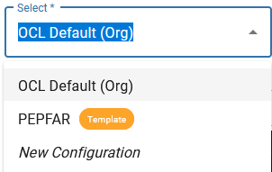

# Configuring TermBrowser Views
Updated 2021-06-22

**Owner:** [Joe](https://github.com/jamlung-ri/)

**Maintainer:** [Joe](https://github.com/jamlung-ri/)

OCL’s TermBrowser visualizes content in the OCL Terminology Service and allows end users to interact with the service. A focus of this product is to facilitate terminology adoption by allowing users to browse and use terminology content. However, there might be better ways to view content than OCL’s default views. This is where TermBrowser user interface (UI) configuration comes into play.

The TermBrowser features quick configuration of content views, so a content administrator can quickly change what tabs and columns appear, and more. This alters how OCL displays content without the need for UI development. This allows administrators to optimize how content is displayed so that users can understand and adopt it easier.

With the proper permissions, the TermBrowser allows administrators to select and alter content views for various resources. This configuration currently uses a JSON-like script, which drives how OCL displays the content. Examples of this script are shown [below](https://github.com/OpenConceptLab/ocl-docs/blob/main/docs/source/oclweb/configuringtermbrowser.md#termbrowser-configuration-examples).

To get started with configuration, navigate to the organization to be configured in the OCL TermBrowser. If using a specific OCL environment, such as QA or Staging, that environment should be a part of the URL. The “configs=true” parameter will allow for configuration, given that the correct administrative privileges are in place.

### Configuration URLs:
Organization:     https://app.[:environment.]openconceptlab.org/#/orgs/[:org]/?configs=true 

Source:     https://app.[:environment.].openconceptlab.org/#/users/[:user]/sources/[source]/?configs=true 
-OR- 
https://app.[:environment.].openconceptlab.org/#/orgs/[:org]/sources/test/?configs=true 

Collection:     https://app.[:environment.].openconceptlab.org/#/users/[:user]/collections/test/?configs=true
-OR-
https://app.[:environment.].openconceptlab.org/#/orgs/[:org]/collections/[collection]/?configs=true

### Getting Started

On this page, an orange button should appear with the name of the current configuration. Clicking the large button on the left shows the available views and enables the creation or modification of view configurations. Click on the small button on the right to see a view that is already configured.  

When viewing available views, a configuration menu will appear at the side, offering multiple options for interaction with the views for that resource (organization, source, etc.). In particular, the Select dropdown is used to select any configured view, view templates that are made available by OCL, and start a new configuration. The New Configuration option will create a blank configuration that can be edited by the administrator, using the configuration options defined below.

### Creating a View from an OCL Template

Some configuration templates have already been created by the OCL team and are available for adaptation in other organizations, sources, etc. To get started using a template, select the template using the Select dropdown. This will show what your content will look like if it used this template as is. 

To make your own configuration based on the template, click the More Options button and select “Create Similar”. Name this configuration, and follow the instructions laid out in the [Advanced Configuration](https://github.com/OpenConceptLab/ocl-docs/blob/main/docs/source/oclweb/configuringtermbrowser.md#advanced-configuration) section to adapt the template for your content’s needs.

### Advanced Configuration
When viewing the JSON configuration file for a view, there are many options available to change how the view appears, what tabs there should be, etc. For examples of advanced configuration, see the templates available in OCL.

| Option        | Description                                                                                                                                                                                                                                                                                                                                                                                                                                                                                                                                                                                                                                                                                                                                                                                                                                                                                                                                                               | Required/ Optional                     | Expected Input(s)                                                                                                                                       | Maximum # allowed |
| ------------- | ------------------------------------------------------------------------------------------------------------------------------------------------------------------------------------------------------------------------------------------------------------------------------------------------------------------------------------------------------------------------------------------------------------------------------------------------------------------------------------------------------------------------------------------------------------------------------------------------------------------------------------------------------------------------------------------------------------------------------------------------------------------------------------------------------------------------------------------------------------------------------------------------------------------------------------------------------------------------- | -------------------------------------- | ------------------------------------------------------------------------------------------------------------------------------------------------------- | ----------------- |
| tabs          | Individual sub-pages within an organization, allowing users to switch to different sets of content or ways of viewing content. Each tab is individually configured.                                                                                                                                                                                                                                                                                                                                                                                                                                                                                                                                                                                                                                                                                                                                                                                                       | Required                               | List of tabs to be displayed                                                                                                                            | Unlimited         |
| type          | Specifies which type of tab it will be. For example, a “source” or “collection” tab lists that organization’s source(s) and collection(s), respectively. Every tab must have a type specified, and the type of tab will dictate what other attributes can be used. See Tab Types for more details on each type. Note: “About” tabs can only use two options in the Advanced Configuration table: type and Label. “Text” tab configuration can be found in the Text Tabs section.                                                                                                                                                                                                                                                                                                                                                                                                                                                                                          | Required                               | Select one: sources, collections, users, about, text, concepts, mappings                                                                                | 1                 |
| uri           | Points the configuration toward which resource to display on the page. If configuring a tab that is in its Usual Placement (see Tab Types), this is implied and does not need to be specified in the configuration file. Example: When configuring a source, which typically displays concepts or mappings, a collections tab also can be displayed as long as a URI is specified.                                                                                                                                                                                                                                                                                                                                                                                                                                                                                                                                                                                        | Required if outside of Usual Placement | {uri: '\[OCL resource url\]'}                                                                                                                           | 1                 |
| layout        | Default layout that shows when first navigating to the configured page.                                                                                                                                                                                                                                                                                                                                                                                                                                                                                                                                                                                                                                                                                                                                                                                                                                                                                                   | Required                               | Select one: table, list                                                                                                                                 | 1                 |
| label         | The label for that tab                                                                                                                                                                                                                                                                                                                                                                                                                                                                                                                                                                                                                                                                                                                                                                                                                                                                                                                                                    | Required                               | Any short string                                                                                                                                        | 1                 |
| filters       | Specifies the filters to be used in the tab. There are two filter types: Context Filters and User Filters. One or both types can be specified. Context Filters: These filters set the context for the tab by specifying what sort of resource will or will not appear. These cannot be changed by users. For example, a “Dictionaries” tab might have a filter of “source\_type: Dictionary” so that only the source’s dictionaries will be listed in this tab. This can leverage “!” to exclude instead (example: “source\_type: '!Dictionary' ”). User Filters: These filters specify filters for users to interact with. This allows creating new filters using Extra attributes. When creating these, a name for the filter and options from which the user can choose must be specified. A tooltip can also be specified to give the user more information when hovering their cursor over the filter button. A default value for this filter can also be specified. | Optional                               | Context Filter: \[OCL field\] : \[value\] ; User Filter: \[OCL field\] : {name (required), tooltip (optional), default (optional), \[list of options\]} | Unlimited         |
| fields        | OCL fields that will be displayed in the tab. If not specified, OCL will default to show the following fields: Owner, ID, Name, Type. Labels can also be given for that field.                                                                                                                                                                                                                                                                                                                                                                                                                                                                                                                                                                                                                                                                                                                                                                                            | Optional                               | \[OCL field\] : ‘\[label\]’                                                                                                                             | 4                 |
| page\_size    | The number of resources to be displayed in the list                                                                                                                                                                                                                                                                                                                                                                                                                                                                                                                                                                                                                                                                                                                                                                                                                                                                                                                       | Optional                               | A number                                                                                                                                                | 1                 |
| query\_params | Custom query parameters to be included in the search. Use “includeExtras” to include one or more of OCL’s Extra attributes as part of the configuration.                                                                                                                                                                                                                                                                                                                                                                                                                                                                                                                                                                                                                                                                                                                                                                                                                  | Optional                               | Select one or more: includeExtras: true                                                                                                                 | Unlimited         |
| default       | Specifies which tab should be the first one opened when a user navigates to the organization. Only one tab can be set as default.                                                                                                                                                                                                                                                                                                                                                                                                                                                                                                                                                                                                                                                                                                                                                                                                                                         | Optional                               | True or False                                                                                                                                           | 1                 |
| sortAsc       | Sorts the list in Ascending order, using the value specified in the configuration. The default value is Score, which sorts based on the provided search term, if given.                                                                                                                                                                                                                                                                                                                                                                                                                                                                                                                                                                                                                                                                                                                                                                                                   | Optional                               | Select one: Name, Score                                                                                                                                 | 1                 |
| sortDesc      | Sorts the list in Descending order, using the value specified in the configuration. The default value is Score, which sorts based on the provided search term, if given.                                                                                                                                                                                                                                                                                                                                                                                                                                                                                                                                                                                                                                                                                                                                                                                                  | Optional                               | Select one: Name, Score                                                                                                                                 | 1                 |
| shrinkHeader  | Specifies whether the page header should be collapsed by default. “shrinkHeader = True” means that the header will be collapsed when the page is first accessed. The default value is false. Note that any user can expand or collapse the header using a button on the page.                                                                                                                                                                                                                                                                                                                                                                                                                                                                                                                                                                                                                                                                                             | Optional                               | True or False                                                                                                                                           | 1                 |

#### Tab Types

| Tab Type    | Description                                                           | Usual Placement(s)               |
| ----------- | --------------------------------------------------------------------- | -------------------------------- |
| Sources     | Displays a list of sources in the organization                        | Organization                     |
| Collections | Displays a list of collections in the organization                    | Organization                     |
| Users       | Displays a list of users in the organization                          | Organization                     |
| About       | Displays the text that is in the organization’s About attribute       | Organization                     |
| Text        | Displays one or more strings of text. See [Text Tabs](https://github.com/OpenConceptLab/ocl-docs/blob/main/docs/source/oclweb/configuringtermbrowser.md#text-tabs) for more details. | Organization, Source, Collection |
| Concepts    | Displays a list of concepts within a source or collection             | Source, Collection               |
| Mappings    | Displays a list of mappings within a source or collection             | Source, Collection               |

#### Text Tabs

While the “About” tab type will display the content in the organization’s “About” attribute, “Text” tabs allow the configurer to combine HTML text and attribute values for an organization, source, or collection.

Similar to “About” tabs, these tabs require the configurer to specify the tab’s type and label. Additionally, a “fields” attribute can be specified with a list of one or more text objects to display. Static lines of text can also be formatted using HTML. Formats and examples of these are listed here:

| Text Type           | Description                                                                                                                  | Expected Input                                       | Example                                          |
| ------------------- | ---------------------------------------------------------------------------------------------------------------------------- | ---------------------------------------------------- | ------------------------------------------------ |
| Static Line of Text | Simple text that is defined by the configurer. This text can optionally be formatted with HTML syntax to change its look.    | {value: ‘[HTML format][Input text][/HTML format]’} | {value: 'Main Title'}                   |
| OCL Attribute       | Text that is populated by an attribute from OCL. A configurer can specify the OCL attribute to use, optionally with a label. | { id: '\[OCL attribute\]', label: '\[Label\]' }      | { id: 'collections\_url', label: 'Description' } |

Note that multiple lines of text can be combined in a single text tab. Examples of a text tab can be found below.

## TermBrowser Configuration Examples
**OCL Default JSON**

**Configured TermBrowser JSON**

[Configuration](https://github.com/OpenConceptLab/ocl-docs/blob/main/docs/source/oclweb/PEPFAR%20MER-MSP%20Config%20-%2002Jun2021.txt)

**Text Tab Example**

[Configuration](https://github.com/OpenConceptLab/ocl-docs/blob/main/docs/source/oclweb/PEPFAR%20Text%20Tab%20Testing%20-%20Simple.txt)

**Placing a Tab outside of its Usual Placement - Displaying Concepts in an Organization Configuration**

[Configuration](https://github.com/OpenConceptLab/ocl-docs/blob/main/docs/source/oclweb/Org%20Config%20Example%201.txt)

**Placing a Tab outside of its Usual Placement - Displaying Collections in a Source Configuration**

[Configuration](https://github.com/OpenConceptLab/ocl-docs/blob/main/docs/source/oclweb/Source%20Config%20Example%201.txt)

Documentation Source Link: https://docs.google.com/document/d/1wIEj48Kx4WllTQl_Zk5qPrnjvNdQ04U9M9VUaFzIAvU/edit

