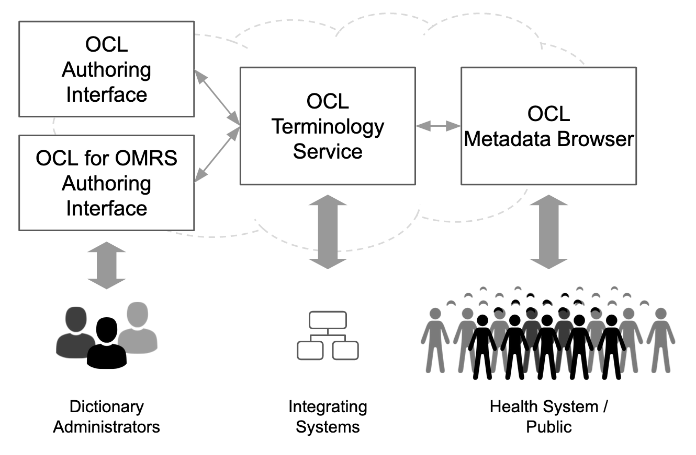

# 2020 OCL Roadmap
## Roadmap Status: DRAFT

**What is the OCL Open-source Product Roadmap?**

The Open Concept Lab Open-source Product Roadmap is a set of milestones for our major products and community-sponsored tools that help us meet the needs of our community of users.

* We will follow a similar roadmap development process as the OpenMRS community, by soliciting community input through several channels (calls, OpenMRS talk survey, tickets) and publishing a draft publicly for final review and prioritization
* We will begin “product releases” in 2020, which will be used to structure feature prioritization. We are also seeking volunteer “Release Managers” for each product.
* Note that timelines and priorities are dependent on resources and client needs and will change accordingly. Any and all goals should be measurable. No goals should be broad or vague.

## Current Status
Over the last 2 years, largely through projects with the Ethiopia Ministry of Health and PEPFAR, OCL has begun to evolve into a toolkit of terminology and metadata management tools.

**Core Products: “OCL Toolkit”**

The OCL toolkit consists of four core products:

| Tool     | Status    | Description     |
| ------------- | ---------- | ----------- |
|  Terminology Service | Production   | Core REST API terminology service|
|  Authoring Interface | Maintenance   | Web application to curate metadata and manage releases |
|  Metadata Browser | Under development   |Primary tool for search and visualizing metadata in OCL & across the OpenHIE stack |
| OpenMRS Authoring Interface and Subscription Module | Beta   |Specialized tool for creating and managing clinical concept dictionaries and an add-on module for OpenMRS to subscribe to a dictionary managed on OCL. |
| Mobile Browser | Prototype  | The OCL metadata browser for a mobile device. JSI developed an Android prototype for Ethiopia |

**Proposed Release Schedule**

| 2020-Q1     | 2020-Q2    | 2020-Q3    | 2020-Q4    |
| ------------- | ---------- | ----------- | ----------- |
|  Metadata Browser Beta Release |    | Metadata Browser Production Release| |

## 2020 Objectives - DRAFT

Vision and strategic goals for 2020 that will shape the priorities for the product roadmaps.

* Basic FHIR TS support (mSVS)
* Web-based CSV import tool
* Timely CIEL releases

## 2020 Roadmap - DRAFT

| Product   | Current Status and 2020 Objectives | 
| ------------- | ---------- | 
| **OCL Core Terminology Service**   [api.openconceptlab.org](https://api.openconceptlab.org/)   [API Documentation](https://github.com/OpenConceptLab/oclapi/wiki)  [oclapi GitHub Repo](https://github.com/OpenConceptLab/oclapi/) |   **Current Status:** In production use and under active development. Cloud hosting of OCL provided by OpenMRS community and used by the OpenHIE Metadata Clearinghouse.   **2020 Objectives:**   <li>Setup [jest test](https://github.com/OpenConceptLab/oclapi/tree/master/integration-tests) scripts framework for OCL core -- All new pull requests must have corresponding jest tests <li> Python 3 upgrade  <li> Reduce Backlog of bugs - Identify the number and decide the percentage and Quarter by which certain percentage is done <li>Enhanced collections (ability to notify of updates and to auto-update) <li>Develop Web-based CSV import tool <li>Improved access management - Too Broad needs to be measurable <li>Bidirectional relationships |
| **OCL Authoring Interface**   [openconceptlab.org](https://openconceptlab.org)   [ocl_web GitHub Repo](https://github.com/OpenConceptLab/ocl_web/)| **Current Status:** V1 of the OCL Authoring Interface is in maintenance mode only. It will be replaced by a new authoring interface that meets the authoring needs of multiple use cases (e.g. OpenMRS, PEPFAR, Ethiopia, WHO).   **2020 Objectives:**   <li>Required maintenance fixes only - Needs to be measurable <li>Sunset ocl_web v1 ASAP <li>Replace with the “OCL for OpenMRS UI” <li>Hierarchical views and navigation |
| **OCL Metadata Browser**   v0.1: [CodePen Prototype](https://codepen.io/paynejd/full/zMqwjQ/) | **Current status:** v2 prototype being developed as part of PEPFAR deliverables.   **2020 Objectives:**  **[2020-Q1]** <li> Beta release of the OCL Metadata Browser Merged display of reference and operational indicator definitions (e.g. published 2018, 2019 PDF reference guide and corresponding DHIS2 indicator representations) <li>Visual display of mappings <li> Few use cases being developed - identify the exact use cases  **[2020-Q2,Q3]** <li>Remaining use cases to be developed - identify the exact use cases|
| **OCL Mobile**   (Ethiopia Prototype) | **Current Status:** Prototype developed for the Ethiopia National Health Data Dictionary for Android OS.  **2020 Objectives:** <li>Conduct user testing and pilot in Ethiopia - How will you measure this? Is this valid now? <li> Develop generic OCL Mobile Android app based on Ethiopia feedback?? How will you measure this? Is just having a |
| **OCL for OpenMRS Authoring Interface**| **Current Status:** V1 significantly developed by the Andela dev team, managed by Darius Jazayeri. Focused on specifically on concept dictionary management requirements of the OpenMRS community, but planned to replace the current OCL authoring interface as more generic editing capabilities are implemented.  [OCL for OpenMRS MVP Requirements](https://docs.google.com/document/d/1R_Fgr5SBl4xFNJgj6yMJNVY63b5H_OUqM55o1GFqFKs/edit#heading=h.uc8prt7aq5b4)  [JIRA Tickets](https://issues.openmrs.org/projects/OCLOMRS/issues/OCLOMRS-724?filter=allopenissues)  **2020 Objectives:** <li>Complete V1 Development in 2020 Q1 <li>Testing and Launch in 2020 Q2|
|**OCL-OpenMRS Subscription Module**| **Current Status:** Ready for testing by OpenMRS Early Adopters Testing Group.  **2020 Objectives:** <li>Establish OpenMRS Early Adopters Testing Group?? <li>Release into production and package with OpenMRS releases along with the new OCL for OpenMRS UI?? |
|**OCL Python Library Development for Integrations**| **Current Status:** Python development library developed (and available) to support software integrations with the OCL API server based on initial requirements from the PEPFAR DATIM community.   **2020 Objectives:** <li>Continue to develop based on community requirements  |
|**Metadata Clearinghouse**| **Current Status:**   **2020 Objectives:**<li>Providing content in OCL - Publishing ICD-10, 11 and Loinc and automating - keeping those things updating in OCL|
|**ETL environment - IMAP services OCL providing integration layer**| **Current Status:** IMAP services OCL providing integration layer   **2020 Objectives:** |

## Additional 2019 Objectives

* **Automated CIEL interface terminology publication in OCL** -- see documentation developed in 2017 here: https://docs.google.com/document/d/1sWsgI16qnlJAhDHxEB92v5L4Q6wqk_V3GVJjxOh7wuo/edit?usp=sharing
    * Enhance OpenMRS authoring interface for “power users” (like Andy!)
    *  Provide dictionary exports for older OpenMRS versions (i.e. v1.6, v1.7)
* **Documentation** - Marketing, User, Technical
* Infrastructure Enhancements

Better forking off of a concept or repo, and then bringing back into the main service
Needs to be able to support multiple reference sources

* [OCL for OpenMRS JIRA Board](https://issues.openmrs.org/secure/RapidBoard.jspa?rapidView=180&projectKey=OCLOMRS)
* [OCL for OMRS MVP Definition](https://docs.google.com/document/d/1R_Fgr5SBl4xFNJgj6yMJNVY63b5H_OUqM55o1GFqFKs/edit#)

If you would like to submit a new [OCL Feature Request](https://forms.gle/2HcTAthiz7r1Zk5H7). Please fill out the form.
