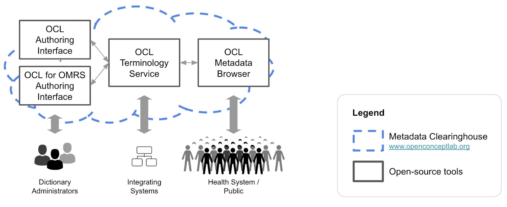

# 2021 Jan-May OCL Roadmap
## Overview
## What is the OCL Open-source Technical Roadmap?
The Open Concept Lab Open-source Product Roadmap is a set of milestones for our major products and community-sponsored tools that help us meet the needs of our community of users.
- We will follow an open roadmap development process by soliciting community input through several channels (meetings, tickets, slack channels) and publishing a draft publicly for final review and prioritization.
- We will begin formal product releases for version 2 releases of each OCL tool, expected in late 2020 and early 2021. Product releases will be used to structure feature prioritization and we are seeking volunteer “Release Managers” for each tool.
- Timelines and priorities are dependent on resources and client needs and will change accordingly.
## OCL Toolkit Overview
The OCL community develops and supports these tools as open-source software that is free to download and use:
- **OCL Terminology Service**: Core REST API terminology service
- **OCL Authoring Interface**: Web client to author metadata and manage releases
- **OCL Metadata Browser**: Primary tool for search and visualizing metadata in OCL
- **OCL for OpenMRS Authoring Interface**: Specialized tool for creating and managing clinical concept dictionaries

OCL also supports the **Metadata Clearinghouse**, which is a shared instance of all OCL's open source tools hosted at www.openconceptlab.org. The Metadata Clearinghouse aims to be a central location for organizations to access and publish terminology and related metadata important to low- and middle-income countries.

## Roadmap
### Summary of Goals
- Launch “generation 2” of the OCL toolkit and infrastructure using a modern, scalable tech stack
- Implement FHIR v4.0.1 terminology services support
- Publish new reference vocabularies in the OCL Metadata Clearinghouse, including ICD-10 and HL7 terminologies
- Enhance support for workflows utilizing terminology services to infer results from patient-level data

### Timeline

### Milestones
#### Product: OCL Terminology Service

| Milestone     | Target    | Description     |
| ------------- | ---------- | ----------- |
|  Launch OCL API v2 | Jan 2021   | Fully refactored OCL API, developed using python3, django3, postgres12, docker with lots of new features and hosted on the new v2 infrastructure |
|  Launch OCL Infrastructure v2 | Jan 2021   | AWS FedRamp-compliant host with scalability improvements, incl. clustering, load balancing, service redundancy, etc.   More details here: [OCL API Upgrade Sep-2020](https://docs.google.com/presentation/d/12aWBZhCzNigDHWUhDdPCeW4ZQCnFc-4_vqsSRTf-TVA/edit?usp=sharing) |
|  SVCM and FHIR v4.0.1 Support | Mar/Apr 2021   | Implementation of FHIR CodeSystem, ValueSet, and ConceptMap resources and operations, terminology services as specified by the Sharing Valuesets and Concept Maps (mSVCM) IHE Profile |

#### Product: OCL Metadata Browser (renamed to OCL TermBrowser)

| Milestone     | Target    | Description     |
| ------------- | ---------- | ----------- |
|  Launch OCL Web v2 | Jan 2021   | Fully refactored OCL web interface developed using ReactJS/MaterialUI and leveraging new OCL v2 API/infrastructure. |
|  Launch OCL Web v2 | Jan 2021   | Fully refactored OCL web interface developed using ReactJS/MaterialUI and leveraging new OCL v2 API/infrastructure.     Supports limited editing and customization of organization pages, and will be enhanced in future milestones to provide a fully customizable presentation of content according to Metadata Browser requirements.
| SVCM/FHIR-TS Connector | May 2021   | Support for the Metadata Browser to connect directly to an SVCM-compliant system to browse terminology resources.|
| Custom Views for Computable Guidance | May 2021   | Customizable templates for viewing metadata associated with emerging computable guidelines. Examples include the WHO Smart Guidelines and the PEPFAR Data Aggregation Service for Health initiatives.|

#### Product: OCL Metadata Clearinghouse (renamed to OCL Online)

| Milestone     | Target    | Description     |
| ------------- | ---------- | ----------- |
|  Launch OCL Community Site | Jan 2021   | New WordPress site that provides a one-stop shop for all things related to OCL. Replaces existing static pages at openconceptlab.org and wikis currently available on GitHub. |
|  Publish ICD10 and HL7 | May 2021   | In addition to currently published content, publish ICD-10 and HL7 terminologies to make them available in the central implementation of OCL’s tools. |

#### Product: OCL Authoring Interface (merged into OCL TermBrowser)

| Milestone     | Target    | Description     |
| ------------- | ---------- | ----------- |
| n/a |  |  |

#### Product: OCL for OpenMRS Authoring Interface (renamed to OCL Dictionary Manager)

| Milestone     | Target    | Description     |
| ------------- | ---------- | ----------- |
| n/a |  |  |

